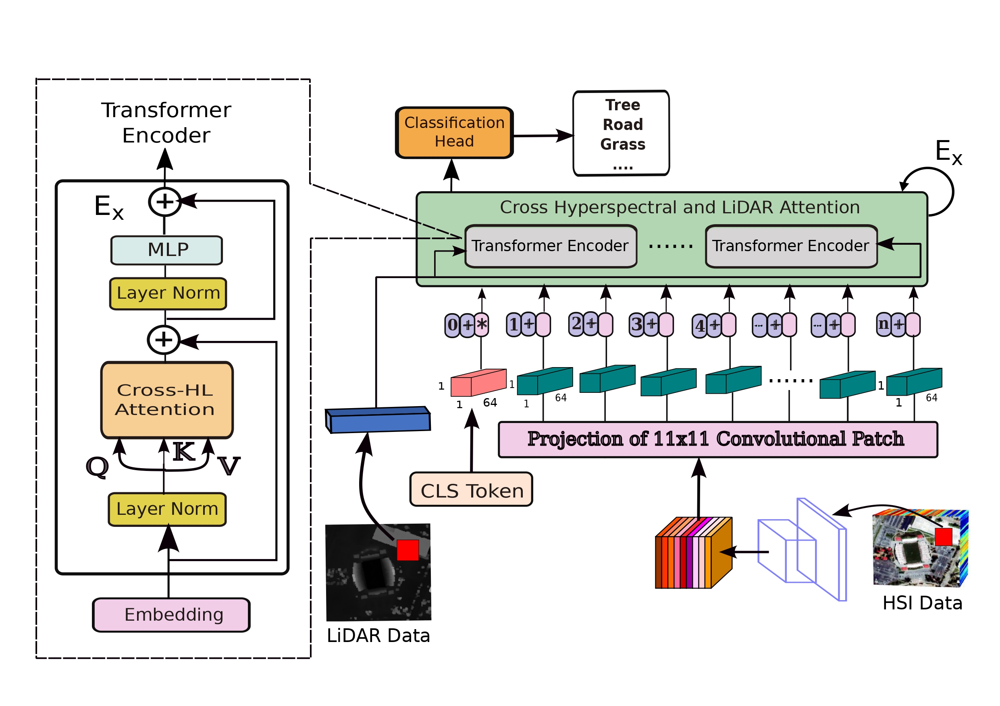

# Cross Hyperspectral and LiDAR Attention Transformer: An Extended Self-Attention for Land Use and Land Cover Classification
[Swalpa Kumar Roy](https://swalpa.github.io), Atri Sukul, [Ali Jamali]([https://sites.google.com/view/danfeng-hong](https://www.researchgate.net/profile/Ali-Jamali)), [Juan Mario Haut](https://mhaut.github.io), and [Pedram Ghamisi]([http://jocelyn-chanussot.net/](http://www.ai4rs.com))

The repository contains the implementations for [Multimodal Fusion Transformer for Remote Sensing Image Classification](https://www.researchgate.net/publication/359647022_Multimodal_Fusion_Transformer_for_Remote_Sensing_Image_Classification).

Citation
---------------------

**Please kindly cite the papers if this code is useful and helpful for your research.**

    @article{roy2022crosshl,
      title={Cross Hyperspectral and LiDAR Attention Transformer: An Extended Self-Attention for Land Use and Land Cover Classification},
      author={Roy, Swalpa Kumar and Sukul, Atri and Jamali, Ali and Haut, Juan Mario and Ghamisi, Pedram},
      journal={IEEE Transactions on Geoscience and Remote Sensing},
      volume = {},
      year={2024},
      doi = {}
    }
